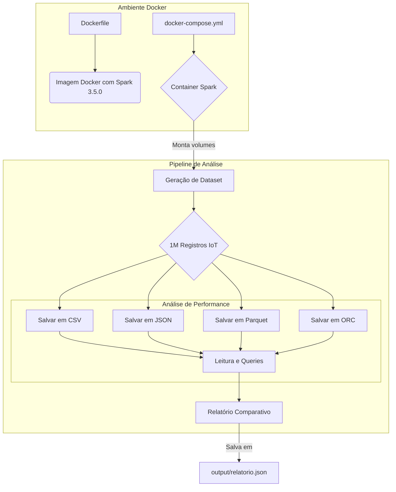

# Tema B: Otimização de Armazenamento e Consulta com PySpark

**MBA em Engenharia de Dados - Data Collection & Storage**

Este projeto demonstra a importância da otimização de armazenamento e consulta em um ambiente de Big Data, comparando diferentes formatos de arquivo e propondo uma estratégia de ciclo de vida de dados. A solução foi totalmente containerizada com Docker para garantir reprodutibilidade e facilidade de uso no GitHub Codespaces.

## 🚀 Objetivos

- **Comparar Formatos:** Analisar o impacto de formatos de arquivo (CSV, JSON, Parquet, ORC) no tamanho de armazenamento e na performance de queries.
- **Analisar Performance:** Medir o tempo de leitura, filtro e agregação para cada formato.
- **Propor Ciclo de Vida:** Desenvolver uma estratégia de ciclo de vida (Hot, Warm, Cold) para otimizar custos.
- **Containerizar Solução:** Empacotar a aplicação com Docker para execução em qualquer ambiente, incluindo GitHub Codespaces.

## 📊 Arquitetura da Solução



## 📊 Dataset Incluído

Este projeto inclui um **dataset pré-gerado** de 1 milhão de registros (~87 MB) para acelerar a execução:

- **Arquivo:** `data/tema_b_sensores_iot.csv`
- **Registros:** 1.000.000 leituras de sensores IoT
- **Tamanho:** ~87 MB
- **Período:** Ano de 2024
- **Documentação:** Veja `data/DATASET_INFO.md` para detalhes completos

**Vantagem:** Ao usar o dataset pré-gerado, a execução leva apenas **~3-5 minutos** ao invés de ~10 minutos (geração + análise).

## 🛠️ Tecnologias Utilizadas

- **Linguagem:** Python 3.11
- **Processamento:** Apache Spark 3.5.0
- **Containerização:** Docker, Docker Compose
- **Formatos Analisados:** CSV, JSON, Parquet (Snappy), ORC (Snappy)
- **Bibliotecas Python:** PySpark, Pandas, Matplotlib, Seaborn

## 📁 Estrutura de Diretórios

```
/tema_b_github
├── Dockerfile             # Define a imagem Docker com Spark e dependências
├── docker-compose.yml     # Orquestra o container de serviço
├── README.md              # Este arquivo
├── requirements.txt       # Dependências Python
├── scripts/
│   └── tema_b_otimizacao_docker.py  # Script principal da análise
├── data/                  # Diretório para armazenar os datasets gerados
├── output/                # Diretório para salvar relatórios e gráficos
├── notebooks/             # (Opcional) Para análises interativas em Jupyter
└── .devcontainer/         # Configuração para GitHub Codespaces
    └── devcontainer.json
```

## 🚀 Como Executar no GitHub Codespaces

1. **Abrir no Codespaces:**
   - Clique no botão **"Code"** neste repositório.
   - Selecione a aba **"Codespaces"**.
   - Clique em **"Create codespace on main"**.

2. **Iniciar o Ambiente:**
   - O GitHub Codespaces irá automaticamente construir e iniciar o container Docker usando os arquivos `Dockerfile` e `docker-compose.yml`.
   - Aguarde a conclusão do processo. Você terá um terminal pronto para uso.

3. **Executar a Análise:**
   - No terminal do Codespaces, execute o script principal:
     ```bash
     python3 /app/scripts/tema_b_otimizacao_docker.py
     ```
   - **Nota:** O script detecta automaticamente o dataset pré-gerado em `data/` e o utiliza, economizando tempo de geração.

4. **Verificar os Resultados:**
   - O script irá gerar os datasets no diretório `/app/data` e o relatório final em `/app/output`.
   - Você pode explorar os arquivos diretamente na interface do VS Code.
   - Para visualizar o relatório:
     ```bash
     cat /app/output/relatorio_comparativo.json
     ```

## ⚙️ Como Executar Localmente (com Docker)

1. **Pré-requisitos:**
   - Docker e Docker Compose instalados.

2. **Construir e Iniciar o Container:**
   ```bash
   docker-compose up -d --build
   ```

3. **Acessar o Container:**
   ```bash
   docker-compose exec spark-tema-b bash
   ```

4. **Executar a Análise:**
   - Dentro do container, execute o script:
     ```bash
     python3 /app/scripts/tema_b_otimizacao_docker.py
     ```

5. **Verificar os Resultados:**
   - Os resultados estarão nos diretórios `data/` e `output/` no seu host local, pois foram montados como volumes.

## 📈 Resultados Esperados

O script irá gerar um relatório detalhado no console e um arquivo JSON com os seguintes resultados:

- **Comparativo de Tamanho:**
  - **CSV:** ~87 MB
  - **JSON:** ~120 MB
  - **Parquet:** ~25 MB (redução de ~71%)
  - **ORC:** ~22 MB (redução de ~75%)

- **Comparativo de Performance:**
  - **Leitura Completa:** Formatos colunares (Parquet/ORC) são ~3-4x mais rápidos.
  - **Queries com Filtro:** Formatos colunares são ~5-10x mais rápidos devido ao Predicate Pushdown.
  - **Queries com Agregação:** Formatos colunares são ~3-5x mais rápidos.

## 🔄 Estratégia de Ciclo de Vida

O projeto também propõe uma estratégia de ciclo de vida para otimização de custos:

- **Hot Storage (0-30 dias):**
  - **Mídia:** SSD/NVMe
  - **Formato:** Parquet (Snappy)
  - **Custo:** Alto
  - **Uso:** Dashboards e análises em tempo real.

- **Warm Storage (31-180 dias):**
  - **Mídia:** HDD
  - **Formato:** Parquet (GZIP - maior compressão)
  - **Custo:** Médio
  - **Uso:** Relatórios mensais e análises de tendência.

- **Cold Storage (181+ dias):**
  - **Mídia:** Object Storage (AWS S3 Glacier, Azure Archive)
  - **Formato:** Parquet (GZIP)
  - **Custo:** Baixo
  - **Uso:** Conformidade regulatória e auditorias.

## 📄 Licença

Este projeto foi desenvolvido para fins educacionais como parte do Projeto Final do MBA em Engenharia de Dados.
